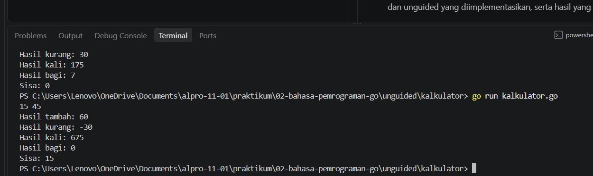

[text](laprak_Modul00.md)# <h1 align="center">Laporan Praktikum Modul [Nomor Modul] - [Judul Modul/Topik]</h1>
<p align="center">[Yahya al wahab] - [109092600004]</p>

## Dasar Teori

### A. [Bahasa Pemrograman Go]
[Go atau Golang adalah bahasa pemrograman yang dikembangkan oleh Google. Go dirancang sebagai bahasa yang sederhana, efisien, dan mudah digunakan untuk membangun berbagai jenis perangkat lunak. Menurut The Go Authors (2026), Go merupakan bahasa pemrograman yang memiliki sintaks sederhana serta mendukung pemrograman terstruktur dan konkurensi.]

### B. [Package dan Struktur Program di Go]

#### 1. [Pengertian Package main]
[package main adalah bagian awal dalam program Go yang menunjukkan bahwa file tersebut termasuk ke dalam package main. Package ini digunakan untuk membuat program yang dapat dijalankan (executable).
Program yang menggunakan package main harus memiliki fungsi main() sebagai titik awal eksekusi program. Ketika program dijalankan, Go akan memulai proses dari fungsi tersebut.]

#### 2. [pengertian import "fmt"]
[import "fmt" digunakan untuk mengimpor package fmt ke dalam program Go. Package fmt menyediakan berbagai fungsi untuk melakukan input dan output, seperti menampilkan informasi ke layar dan menerima masukan dari pengguna.]

#### 3. [penjelasan statement/pernytataan]
[Statement adalah perintah atau instruksi dalam program yang digunakan untuk menjalankan suatu tindakan. Dalam bahasa Go, statement ditulis di dalam fungsi dan akan dijalankan sesuai dengan urutan program.]

poin-poin statement:

-Menjalankan perintah
Statement digunakan untuk memberikan instruksi kepada program, seperti menampilkan teks atau melakukan perhitungan.
-Dijalankan secara berurutan
Statement biasanya dijalankan dari atas ke bawah sesuai urutan penulisannya.
-Dapat melakukan perhitungan
Contohnya:

hasil := 10 + 5

## Guided

### 1. [tukar.go]

```go
package main
import "fmt"

func main(){
	var a, b int
	
	fmt.Scan(&a,&b)
	a, b = b, a
	fmt.Println(a, b)
}
```
#### Deskripsi
[program Go yg saya buat untuk menukar nilai dua variabel. Program menerima dua angka dari pengguna, kemudian nilai a dan b ditukar dan hasilnya ditampilkan. Program berhasil dijalankan dan menghasilkan nilai yang sudah ditukar sesuai input.]

### 2. [lingkaran.go]

```go
[package main
import "fmt"

func main(){
	var pi = 3.14
	var r float64
	
	fmt.Scanln(&r)

	var luas float64 = pi * r * r
	
	fmt.Println(luas)
}]
```
#### Deskripsi
[Pada praktikum ini, saya membuat program Go untuk menghitung luas lingkaran. Program menerima nilai jari-jari dari pengguna, kemudian menghitung luas menggunakan rumus π × r × r. Program berhasil dijalankan dan menghasilkan luas sesuai dengan nilai jari-jari yang dimasukkan.]

### 3. [skor.go]
```go
package main
import "fmt"

func main(){
	var nama string
	var skormatematika, skorbahasainggris int

	// Membaca input
	fmt.Scan(&nama, &skorbahasainggris, &skormatematika)

	// Menghitung total & rata-rata 
	total := skormatematika + skorbahasainggris
	rataRata := total / 2

	// Menampilkan output
	fmt.Println(nama)
	fmt.Println(total)
	fmt.Println(rataRata)
}
```
#### Deskripsi
Program Go yg saya buat untuk menghitung total dan rata-rata nilai Matematika dan Bahasa Inggris. Program menerima nama dan nilai dari pengguna, kemudian menghitung total serta rata-ratanya. Setelah dijalankan, program berhasil menampilkan nama, total nilai, dan rata-rata sesuai dengan input yang diberikan.

### 4. [suhu.go]
```go
package main
import "fmt"

func main(){
	var celcius float64

	//Menerima suhu dalam celcius
	fmt.Scanln(&celcius)

	//Menghitung suhu dengan rumus
	reamur := celcius * 4.0 / 5.0
	fahrenheit := celcius * 9.0 / 5.0 + 32.0
	kelvin := celcius + 273.15

	//Mencetak tiga nilai keluaran di pisahkan oleh spasi
	fmt.Println(reamur, fahrenheit, kelvin)
}
```
#### Deskripsi
Program Go ini untuk mengubah suhu dari Celcius ke Reamur, Fahrenheit, dan Kelvin. Program menerima input suhu Celcius, lalu menghitung hasil konversinya menggunakan rumus yang sesuai. Setelah dijalankan, program berhasil menampilkan ketiga hasil konversi dengan benar.
	
## Unguided

### 1. [cacahuang.go]

```go
[package main
import "fmt"

func main(){
	var nominal int

	//Membaca nominal masukan uang
	fmt.Scanln(&nominal)

	//Menghitung lembar sepuluh ribu
	sepuluhRibu := nominal / 10000
	sisa := nominal % 10000

	//Menghitung lembar lima ribu dari sisa sebelumnya
	limaRibu := sisa / 5000
	sisa = sisa % 5000

	//Menghitung lembar seribu dari sisa sebelumnya
	seribu := sisa / 1000

	//Tampilkan hasil berupa tiga bilangan bulat dipisahkan spasi
	fmt.Printf("%d %d %d\n", sepuluhRibu, limaRibu, seribu)
}]
```

##### Output
<!-- Path relatif dari readme.md ke folder unguided/[nama_soal]/output.png, contoh: -->
![unguided/cacahuang/output.png]


#### Deskripsi
[Praktikum ini mengimplementasikan program Go untuk menghitung pecahan uang Rp10.000, Rp5.000, dan Rp1.000. Pada bagian guided dipelajari struktur dasar Go, input, variabel, dan output. Pada bagian unguided diterapkan operasi pembagian dan sisa bagi. Hasilnya, program dapat menghitung dan menampilkan jumlah masing-masing pecahan berdasarkan nominal yang dimasukkan.]

### 2. [kalkulator]

```go
[package main
import "fmt"

func main(){
	var a, b int

	fmt.Scan(&a, &b)
	tambah := a + b
	kurang := a - b
	kali := a * b
	bagi := a / b
	sisa := a % b

	fmt.Println("Hasil tambah:", tambah)
	fmt.Println("Hasil kurang:", kurang)
	fmt.Println("Hasil kali:", kali)
	fmt.Println("Hasil bagi:", bagi)
	fmt.Println("Sisa:", sisa)
}]
```

##### Output


#### Deskripsi
[Praktikum ini membuat program Go untuk melakukan operasi aritmatika, yaitu penjumlahan, pengurangan, perkalian, pembagian, dan sisa bagi. Program menerima dua bilangan sebagai input dan menampilkan hasil dari setiap operasi.]

<!-- Duplikasi blok "### [nama_soal]" sesuai jumlah folder soal di dalam unguided -->


## Kesimpulan
-Menggunakan `package main` untuk menentukan bahwa program termasuk package utama yang dapat dijalankan oleh Go.
-`import "fmt"` digunakan untuk mengakses fungsi input dan output, seperti `fmt.Scan()` dan `fmt.Println()`.
-Variabel tambah `+`, kurang `-`, kali `*`, bagi `/`, dan sisa `%` digunakan untuk menyimpan hasil dari masing-masing operasi.

## Referensi
1. Google. (2026). The Go Programming Language Documentation. Diakses pada 28 September 2026 melalui https://go.dev/doc/
