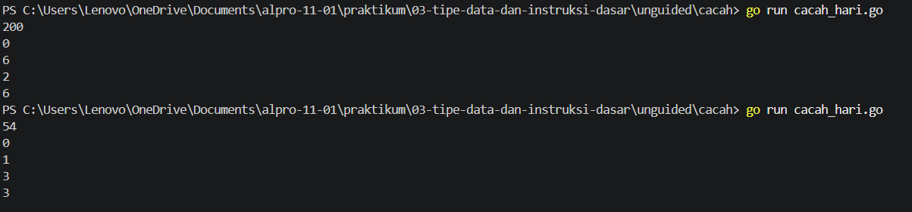
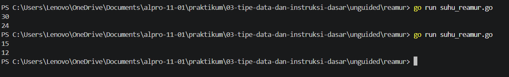

[text](laprak_Modul00.md)# <h1 align="center">Laporan Praktikum Modul03 - variabel dan operator</h1>
<p align="center">[Yahya al wahab] - [109092600004]</p>

## Dasar Teori

### A. variabel
Variabel adalah tempat untuk menyimpan data atau nilai dalam program. Nilai di dalam variabel bisa digunakan dan diubah selama program berjalan.

### B. Operator Aritmatika dan Assignment

#### 1. modulo
Modulo (%) adalah operator aritmatika yang digunakan untuk mencari sisa hasil pembagian.

#### 2. assignment
Assignment adalah operator yang digunakan untuk memberikan atau mengubah nilai pada sebuah variabel.

## Guided

### 1. kasir.go

```go
package main

import "fmt"

func main(){
	var x int

	fmt.Print("masukkan nominal:")
	fmt.Scan(&x)

	var SepuluhRibuan int = x / 10000
	var sisa int = x % 10000

	var LimaRibuan int = sisa /5000
	sisa = sisa % 5000

	var seribuan int = sisa / 1000

	fmt. Println(SepuluhRibuan, LimaRibuan, seribuan)
}
```
#### Deskripsi
Program ini digunakan untuk menghitung jumlah pecahan uang dari nominal yang dimasukkan. Program menghitung berapa lembar Rp10.000, Rp5.000, dan Rp1.000 menggunakan operasi pembagian dan modulo. Hasilnya menampilkan jumlah masing-masing pecahan uang

### 2. konversi.go

```go
package main

import "fmt"

func main(){
	var celcius float64

	fmt.Print("memasukkan suhu: ")
	fmt.Scan(&celcius)

	fmt.Println(celcius + 273)
}
```
#### Deskripsi
Program ini digunakan untuk mengubah suhu dari Celsius ke Kelvin. Program menerima suhu Celsius dari pengguna, lalu menambahkan 273 untuk mendapatkan hasil dalam Kelvin.

### 3. tukar.go
```go
package main 

import "fmt"

func main(){
	var x, y, z int
	fmt.Scan(&x, &y, &z)

	temp := x
	x = z
	z = y
	y = temp

	fmt.Println(x, y, z)
}
```
#### Deskripsi
Program ini digunakan untuk menukar posisi tiga nilai x, y, dan z. Program menggunakan variabel temp sebagai tempat sementara agar nilai tidak hilang saat ditukar. Hasilnya, nilai ketiga variabel berubah sesuai urutan yang ditentukan.
	
## Unguided

### 1. cacah_hari.go

```go
package main
import "fmt"

func main (){
	var jumlahHari int
	fmt.Scan(&jumlahHari)

	var tahun int = jumlahHari / 360
	var sisa int = jumlahHari % 360

	bulan := sisa / 30
	sisa = sisa % 30

	minggu := sisa / 7
	hari := sisa % 7

	fmt.Println(tahun)
	fmt.Println(bulan)
	fmt.Println(minggu)
	fmt.Println(hari)

}
```

##### Output
<!-- Path relatif dari readme.md ke folder unguided/[nama_soal]/output.png, contoh: -->



#### Deskripsi
Program ini digunakan untuk mengonversi jumlah hari menjadi tahun, bulan, minggu, dan hari. Program menggunakan pembagian dan modulo untuk mendapatkan hasil dari setiap satuan waktu. Hasil akhirnya menampilkan jumlah tahun, bulan, minggu, dan hari secara terpisah.

### 2. suhu_reamur.go

```go
package main
import "fmt"

func main (){
	var celcius, reamur float64
	fmt.Scan(&celcius)
	reamur = (4.0/5.0) * celcius
	fmt.Println(reamur)
}
```

##### Output


#### Deskripsi
Program ini digunakan untuk mengubah suhu dari Celsius ke Reamur. Program menerima suhu Celsius, kemudian menghitungnya menggunakan rumus 4/5 × Celsius. Hasilnya menampilkan suhu dalam Reamur.

<!-- Duplikasi blok "### [nama_soal]" sesuai jumlah folder soal di dalam unguided -->


## Kesimpulan
Kesimpulan simple yg dapat di ambil dari kode-kode di atas saya jadi lebih memahami dasar pemrograman Go, terutama penggunaan variabel, input, output, operator aritmatika, pembagian, dan modulo. Kelima program juga membantu memahami cara membuat program untuk menghitung, menukar nilai, dan melakukan konversi sederhana.

## Referensi
1. The Go Authors. (2024). Effective Go. Diakses melalui https://go.dev/doc/effective_go
2. The Go Authors. (2024). The Go Programming Language Documentation. Diakses melalui https://go.dev/doc/ 