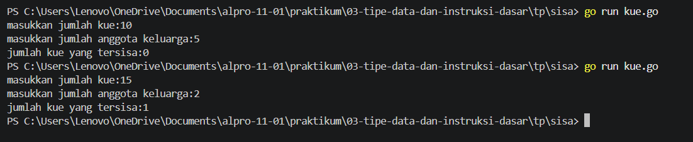
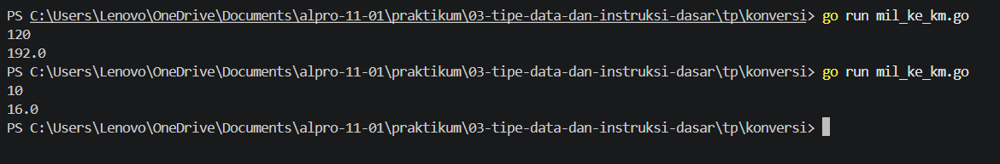
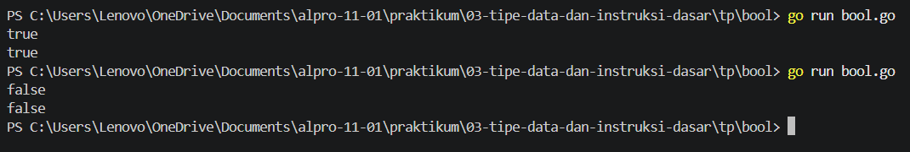

# <h1 align="center">Tugas Pendahuluan Modul [Nomor Modul] - [Judul Modul/Topik]</h1>
<p align="center">[Yahya al wahab] - [109092600004]</p>

### 1. Sisa Kue

```go
[package main

import "fmt"

func main(){

	var y, x int

	fmt.Print("masukkan jumlah kue:")
	fmt.Scan(&y)

	fmt.Print("masukkan jumlah anggota keluarga:")
	fmt.Scan(&x)

	fmt.Print("jumlah kue yang tersisa:")
	fmt.Println(y % x)
}]
```

##### Output
<!-- Path relatif dari readme.md ke folder unguided/[nama_soal]/output.png, contoh: -->



#### Deskripsi
[Praktikum ini membuat program Go untuk menghitung sisa kue setelah dibagikan kepada beberapa anggota keluarga. Saya belajar menggunakan input, output, variabel, dan operasi pembagian. Hasilnya, program dapat menghitung dan menampilkan jumlah kue yang tersisa.]

### 2. [mil_ke_km.go]

```go
package main

import "fmt"

func main() {
	var mil float64
	fmt.Scan(&mil)
	km := mil * 1.6
	fmt.Printf("%.1f\n", km)
}
```

##### Output
<!-- Path relatif dari readme.md ke folder unguided/[nama_soal]/output.png, contoh: -->



#### Deskripsi
[Praktikum ini membuat program Go untuk mengubah jarak dari mil ke kilometer. Saya belajar menggunakan variabel, input, dan operasi perkalian untuk melakukan konversi. Hasilnya, program dapat menampilkan jarak dalam kilometer.]

### 2. [bool.go]

```go
package main

import "fmt"

func main (){
	var a bool
	fmt.Scan(&a)
	fmt.Println(a)
}
```

##### Output
<!-- Path relatif dari readme.md ke folder unguided/[nama_soal]/output.png, contoh: -->



#### Deskripsi
[Praktikum ini membuat program Go untuk menerima dan menampilkan nilai boolean. Saya belajar menggunakan tipe data `bool`, input dengan `fmt.Scan()`, dan menampilkan hasil dengan `fmt.Println()`. Hasilnya, program dapat menampilkan nilai `true` atau `false` yang dimasukkan.]

## Kesimpulan
[Saya sedikit seikit mulai memahami dasar pemrograman Go seperti penggunaan variabel, input, output, operasi hitung, dan tipe data boolean.]