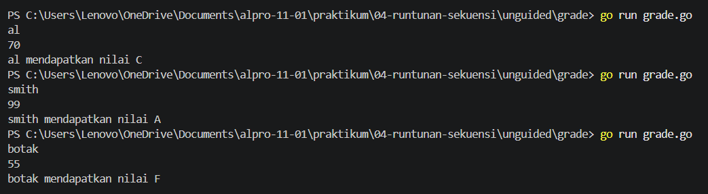
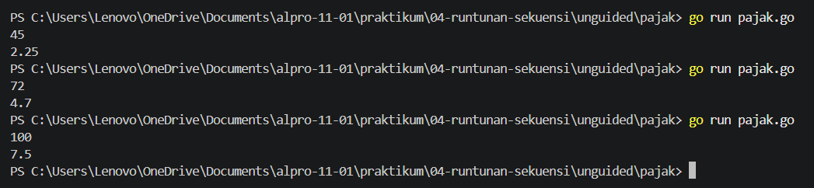

[text](laprak_Modul00.md)# <h1 align="center">Laporan Praktikum Modul 04 - RUNTUNAN/SEKUENSI</h1>
<p align="center">[Yahya al wahab] - [109092600004]</p>

## Dasar Teori

### A. Runtunan/sekuensi
Runtunan atau sekuensi adalah struktur dasar dalam algoritma yang menjalankan setiap instruksi secara berurutan dari awal hingga akhir sesuai dengan urutan yang telah ditentukan. Setiap perintah akan dilakukan satu per satu, sehingga hasil dari suatu proses dapat digunakan untuk proses berikutnya.


### B. Percabangan

#### 1. if-else
digunakan untuk menentukan pilihan berdasarkan suatu kondisi. Jika kondisi pada if bernilai benar, maka perintah di dalamnya dijalankan. Jika kondisi salah, maka program akan menjalankan perintah pada bagian else.

#### 2. switch-case
digunakan untuk memilih satu dari beberapa pilihan berdasarkan nilai tertentu. Program akan mencocokkan nilai dengan setiap case, kemudian menjalankan perintah pada case yang sesuai.

## Guided

### 1. grade.go

```go
package main

import (
	"bufio"
	"os"

	"fmt"
)

func main(){
	var nama string
	var nilai float64
	var grade string

	scanner := bufio.NewScanner(os.Stdin)
	scanner .Scan()

	nama = scanner.Text()

	fmt.Scan(&nilai)

	if nilai >= 90 && nilai <= 100 {
		grade = "A"
	} else if nilai >= 80 && nilai < 90 {
		grade = "B"
	} else if nilai >= 70 && nilai < 80 {
		grade = "C"
	} else if nilai >= 60 && nilai < 70 {
		grade = "D"
	} else {
		grade = "F"
	}


	fmt.Printf("%s mendapatkan nilai %s\n", nama, grade)
}
```
#### Deskripsi
Program ini menggunakan percabangan if-else untuk menentukan grade nilai berdasarkan nilai yang dimasukkan pengguna, dengan input berupa nama dan nilai, kemudian menampilkan nama beserta grade A, B, C, D, atau F sesuai rentang nilai.

### 2. klasifikasi.go

```go
package main

import (
	"fmt" //hanya memerlukan fmt untuk keperluan input dan output
)

func main(){
	//pendefinisian variabel secara ekplisit beserta tipe datanya
	var usia int
	var gaji int
	var keterangan string

	//membaca dua masukan berupa angka dari pengguna (usia dan gaji)
	//fmt.Scan otomatis memisahkan input berdasarkan spasi atau baris baru (enter)
	fmt.Scan(&usia)
	fmt.Scan(&gaji)

	//menggunakan switch tanpa ekspresi.
	//cara kerjanya sama persis seperti if-else if.
	//program akan mengecek dari atas ke bawah, dan menjalankan case pertama yang bernilai benar (true)
	switch {
	case usia < 18:
		keterangan = "masih sekolah"
	case usia >= 18 && usia <= 25 && gaji >= 50:
		keterangan = "muda sukses"
	case usia >= 18 && usia <= 25 && gaji < 50:
		keterangan = "masih belajar hidup"
	case usia >= 26 && usia <= 40 && gaji >= 100:
		keterangan = "pekerja mapan"
	case usia >= 26 && usia <= 40 && gaji < 100:
		keterangan = "perlu perbaiki karier"
	case usia > 40 && gaji >= 150:
		keterangan = "profesional berpengalaman"
	case usia > 40 && gaji < 150:
		keterangan = "perllu evaluasi finansal"
	}

	//menampilkan hsail klasifikasi ke layar
	fmt.Println(keterangan)
}
```
#### Deskripsi
Program ini digunakan untuk menerima input usia dan gaji, kemudian menggunakan switch-case tanpa ekspresi untuk mengklasifikasikan kondisi seseorang berdasarkan rentang usia dan jumlah gaji, lalu menampilkan keterangan yang sesuai.

### 3. penilaian.go
```go
package main
import (
	"bufio" 
	//digunakan untuk membaca masukan string yang memeiliki spasi (seperti nama lengkap)
	"fmt"
	"os"
	//menyediakan akses ke sistem operasi, dalam hal ini os.Stdin yang mempresentasikan keyboard
) 

func main(){
	//pendefinisian variabel secara eksplisit beserta tipe datanya
	var pilihan int
	var nama string
	var nilai float64
	var grade string

	//menampilkan cetakan Menu ke layar
	fmt.Println("========== Menu ==========")
	fmt.Println("1. Sistem penilaian")
	fmt.Println("0. Keluar")
	fmt.Print("pilih opsi:")

	//membaca masukan pilihan (angka).
	//kita menggunakan Scanln agar saat user menekan 'Enter, karakter enter tersebut
	//ikut di olah/dibersihkan dan tidak melompat (mengganggu) masukan nama di bawahnya.
	fmt.Scanln(&pilihan)

	//percabangan/sekuesi bersyarat berdasarkan input pengguna
	if pilihan == 1 {
		fmt.Print("masukkan nama siswa:")

	//membuat alat pembaca (scanner) baru yang mengambil masukkan dari keyboard
	scanner := bufio.NewScanner(os.Stdin)

	//proses membaca masukan dari pengguna sampai tombol enter ditekan
	scanner.Scan()

	//mengambil text (nama) yang baru saja di baca dan menyimpannya ke variabel 
	nama = scanner.Text()

	fmt.Print("masukkan nilai siswa:")
	fmt.Scanln(&nilai)

	//menentukan grade nilai
	if nilai >= 90 && nilai <= 100 {
		grade = "A"
	} else if nilai >= 80 && nilai < 90 {
		grade = "B"
	} else if nilai >= 70 && nilai < 80 {
		grade = "C"
	} else if nilai >= 60 && nilai < 70 {
		grade = "D"
	} else {
		grade = "F"
	}

	//%s adalah format (placeholder) untuk mencetak data bertipe string
	//% pertama akan digantikan oleh isi variabel 'nama', %s kedua oleh 'grade'
	fmt.Printf("%s mendapatkan nilai %s\n", nama, grade)

	} else if pilihan == 0 {
		//di jalankan jika pengguna mengetik 0
		fmt.Println("keluar dari program.")

	} else {
		//dijalankan jika pengguna mengitik angka selain 1 dan 0 
		fmt.Println("pilihan tidak valid")
	}
}
```
#### Deskripsi
Program ini digunakan untuk membuat menu sistem penilaian, di mana pengguna dapat memilih opsi untuk memasukkan nama dan nilai siswa, kemudian program menentukan grade A–F menggunakan percabangan if-else, atau memilih 0 untuk keluar dari program.
	
## Unguided

### 1. grade.go

```go
package main

import (
	"bufio"
	"fmt"
	"os"
)

func main() {
	var nama string
	var nilai float64
	var grade string

	scanner := bufio.NewScanner(os.Stdin)
	scanner.Scan()

	nama = scanner.Text()

	fmt.Scan(&nilai)

	switch {
	case nilai >= 90 && nilai <= 100:
		grade = "A"
	case nilai >= 80 && nilai < 90:
		grade = "B"
	case nilai >= 70 && nilai < 80:
		grade = "C"
	case nilai >= 60 && nilai < 70:
		grade = "D"
	default:
		grade = "F"
	}

	fmt.Printf("%s mendapatkan nilai %s\n", nama, grade)
}
```
##### Output
<!-- Path relatif dari readme.md ke folder unguided/[nama_soal]/output.png, contoh: -->


#### Deskripsi
Program ini digunakan untuk menerima input nama dan nilai siswa, kemudian menggunakan percabangan switch-case untuk menentukan grade A, B, C, D, atau F berdasarkan rentang nilai, lalu menampilkan nama dan grade yang diperoleh.


### 2. pajak.go

```go
package main

import "fmt"

func main() {
	var penghasilan float64
	var pajak float64

	fmt.Scan(&penghasilan)

	if penghasilan <= 50 {
		pajak = 0.05 * penghasilan
	} else if penghasilan <= 100 {
		pajak = 0.05*50 + 0.10*(penghasilan-50)
	} else if penghasilan <= 200 {
		pajak = 0.05*50 + 0.10*50 + 0.15*(penghasilan-100)
	} else {
		pajak = 0.05*50 + 0.10*50 + 0.15*100 + 0.20*(penghasilan-200)
	}

	fmt.Println(pajak)
}
```

##### Output


#### Deskripsi
Program ini digunakan untuk menghitung pajak berdasarkan jumlah penghasilan yang dimasukkan, dengan menggunakan percabangan if-else untuk menentukan persentase pajak sesuai dengan rentang penghasilan.

<!-- Duplikasi blok "### [nama_soal]" sesuai jumlah folder soal di dalam unguided -->


## Kesimpulan

Dari kelima program tersebut dapat disimpulkan bahwa percabangan dalam bahasa Go digunakan untuk mengambil keputusan berdasarkan kondisi tertentu. Percabangan `if-else` digunakan untuk menentukan pilihan berdasarkan beberapa kondisi, sedangkan `switch-case` digunakan untuk memilih tindakan sesuai kondisi atau nilai yang sesuai. Kelima program juga menunjukkan penerapan input, variabel, operator perbandingan dan logika, serta proses pengolahan data untuk menghasilkan output yang sesuai.

## Referensi
1. Donovan, A. A. A., & Kernighan, B. W. (2015). The Go Programming Language. Addison-Wesley Professional.