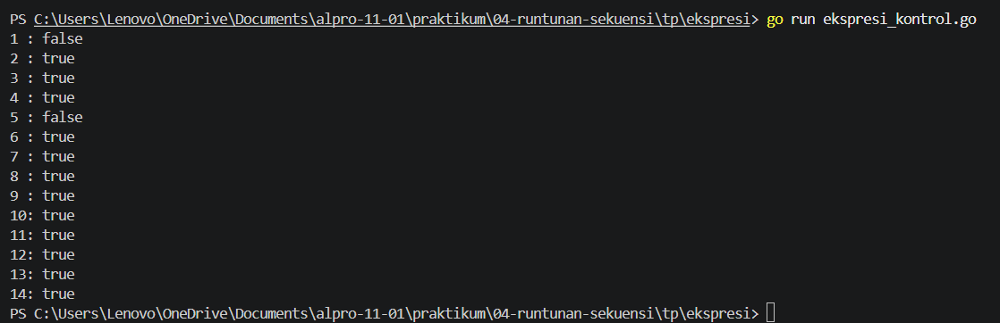
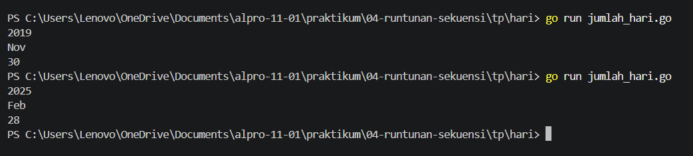
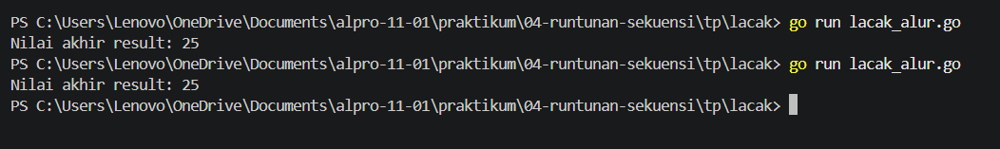

# <h1 align="center">Tugas Pendahuluan Modul 04 - RUNTUNAN/SEKUENSI </h1>
<p align="center">[Yahya al wahab] - [109092600004]</p>

### 1. ekspresi_kontrol.go

```go
package main

import "fmt"

func main() {
	intNum := 5
	intOther := 10
	var sngNum float64 = -3

	fmt.Println("1 :", intNum > 5)
	fmt.Println("2 :", intNum >= 5 && intOther < 11)
	fmt.Println("3 :", sngNum != -1 || intOther < 0)
	fmt.Println("4 :", !(intNum > 3) || intNum <= 5)
	fmt.Println("5 :", !(intOther >= intNum))
	fmt.Println("6 :", 0-sngNum > 0)
	fmt.Println("7 :", 4/2 == intOther/intNum)
	fmt.Println("8 :", intOther%2 == 0)
	fmt.Println("9 :", intOther+2*intNum != 30 || !(sngNum > 0))
	fmt.Println("10:", intOther > 0 && intNum > 0 || sngNum > 0)
	fmt.Println("11:", sngNum > 0 || (intNum >= 0 && -1*intOther == -10))
	fmt.Println("12:", intNum == 5)
	fmt.Println("13:", intNum > 0 || (sngNum <= 0 && intOther == 13))
	fmt.Println("14:", !(!(!(!(intNum > 0)))))
}
```

##### Output
<!-- Path relatif dari readme.md ke folder unguided/[nama_soal]/output.png, contoh: -->



#### Deskripsi
Program ini digunakan untuk menguji operator perbandingan dan logika dalam bahasa Go menggunakan tiga variabel, yaitu `intNum = 5`, `intOther = 10`, dan `sngNum = -3`, yang menghasilkan nilai `true` atau `false` dari berbagai kondisi.


### 2. jumlah_hari.go

```go
package main

import "fmt"

func main() {
	var tahun int
	var bulan string

	fmt.Scan(&tahun, &bulan)

	kabisat := (tahun%4 == 0 && tahun%100 != 0) || tahun%400 == 0

	switch bulan {
	case "Jan", "Mar", "Mei", "Jul", "Agu", "Okt", "Des":
		fmt.Println(31)
	case "Apr", "Jun", "Sep", "Nov":
		fmt.Println(30)
	case "Feb":
		if kabisat {
			fmt.Println(29)
		} else {
			fmt.Println(28)
		}
	default:
		fmt.Println("-")
	}
}
```

##### Output
<!-- Path relatif dari readme.md ke folder unguided/[nama_soal]/output.png, contoh: -->



#### Deskripsi
Program ini digunakan untuk menentukan jumlah hari dalam suatu bulan berdasarkan tahun yang dimasukkan, dengan memperhatikan tahun kabisat dan menggunakan switch untuk menentukan jumlah hari setiap bulan.


### 2. lacak_alur.go

```go
package main

import "fmt"

func main() {
	x := 10
	y := 5
	z := 15
	result := 0

	if x > 5 {
		if y < 10 {
			result = x + y
		} else {
			result = x - y
		}
	}

	if z > 10 && x == 10 {
		result += z
	} else {
		result = z - x
	}

	if x == 10 || y > 10 {
		result += 5
	} else if y == 5 && z > 10 {
		result -= 5
	} else {
		result *= 2
	}

	if !(x < 15 && y < 10) {
		result += 10
	} else {
		result -= 10
	}

	fmt.Println("Nilai akhir result:", result)
}
```

##### Output
<!-- Path relatif dari readme.md ke folder unguided/[nama_soal]/output.png, contoh: -->



#### Deskripsi
Program ini digunakan untuk menghitung nilai akhir `result` menggunakan tiga variabel yaitu `x = 10`, `y = 5`, dan `z = 15` melalui beberapa percabangan `if`, operator logika, dan operasi aritmatika.


## Kesimpulan
Kesimpulannya adalah ketiganya digunakan untuk memahami penggunaan variabel, operator logika dan perbandingan, serta percabangan if dan switch dalam bahasa Go untuk menghasilkan keputusan dan perhitungan berdasarkan kondisi yang diberikan.